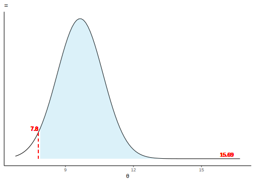
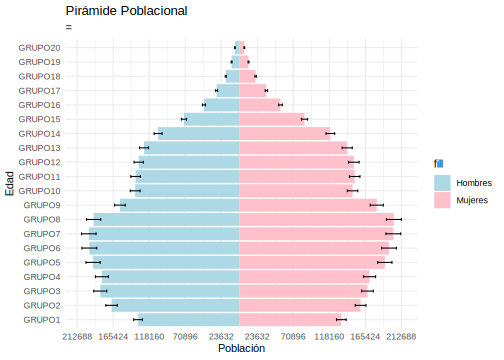
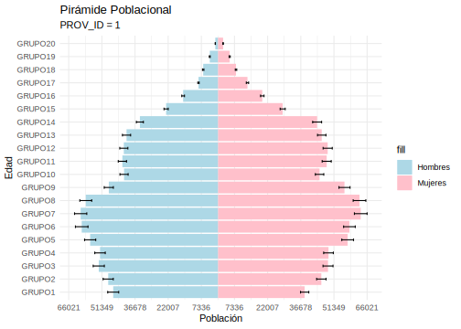
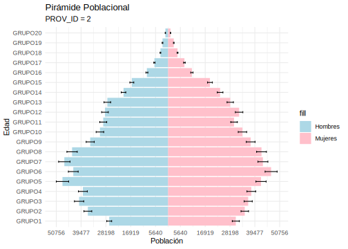
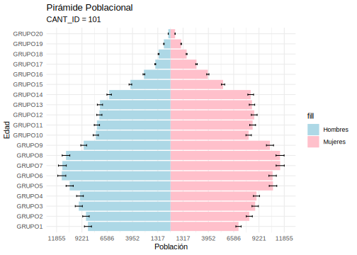
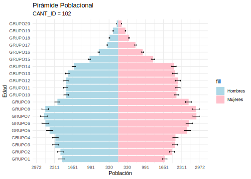

# Estimaciones Agregadas

En esta sección, ilustramos la metodología empleada para obtener estimaciones en varios niveles de agregación, utilizando un conjunto de funciones personalizadas adaptadas a este conjunto de datos específico. Estas funciones facilitan el proceso de generar predicciones y visualizaciones, lo que nos permite analizar de manera efectiva las estimaciones de población.


```r
### Libraries ###

library(tidyverse)
library(data.table)
library(openxlsx)
library(magrittr)
library(lme4)
library(rstan)
library(rstanarm)
source("Recursos/07_Resultados/Rcodes/01_Agregados.R")
```



```r
cat("\f")
```


- **plot_densidad**: Esta función grafica la densidad de una distribución normal con una media y desviación estándar especificadas. Además, resalta un intervalo específico de la distribución con un área sombreada y segmentos en el gráfico.

- **Pred_desocupado**: Esta función realiza cálculos y visualizaciones relacionados con los datos de desempleo en un censo.

- **Pred_totPob**: Esta función realiza cálculos y visualizaciones relacionados con los datos de población total en un censo.

- **plot_piramide_pob**: Genera un gráfico de pirámide de población con barras e intervalos de confianza.

- **piramide_pob**: Calcula y visualiza la pirámide de población a partir de los datos del censo.


### Reading the census data.{-}


```r
censo_vivienda <- readRDS("Recursos/07_Resultados/Data/05_censo_vivienda_personas_grupo_edad.rds")
```

## Prediction of the unoccupied household rate 


```r
p1 <-  Pred_desocupado(censo_vivienda,
                agrega = NULL,
                Plot = TRUE,
                filtro = NULL) 
```



```r
tba(p1)
```

<table class="table table-striped lightable-classic" style="width: auto !important; margin-left: auto; margin-right: auto; font-family: Arial Narrow; width: auto !important; margin-left: auto; margin-right: auto;">
 <thead>
  <tr>
   <th style="text-align:right;"> total </th>
   <th style="text-align:right;"> Porcen </th>
   <th style="text-align:right;"> LimInf </th>
   <th style="text-align:right;"> LimSup </th>
   <th style="text-align:right;"> Len_IC </th>
   <th style="text-align:right;"> SE </th>
  </tr>
 </thead>
<tbody>
  <tr>
   <td style="text-align:right;"> 170596 </td>
   <td style="text-align:right;"> 9.6495 </td>
   <td style="text-align:right;"> 7.8008 </td>
   <td style="text-align:right;"> 15.6923 </td>
   <td style="text-align:right;"> 7.8915 </td>
   <td style="text-align:right;"> 2.0131 </td>
  </tr>
</tbody>
</table>


```r
Pred_desocupado(censo_vivienda, agrega = "PROV_ID") %>% tba()
```

<table class="table table-striped lightable-classic" style="width: auto !important; margin-left: auto; margin-right: auto; font-family: Arial Narrow; width: auto !important; margin-left: auto; margin-right: auto;">
 <thead>
  <tr>
   <th style="text-align:left;"> PROV_ID </th>
   <th style="text-align:right;"> total </th>
   <th style="text-align:right;"> Porcen </th>
   <th style="text-align:right;"> LimInf </th>
   <th style="text-align:right;"> LimSup </th>
   <th style="text-align:right;"> Len_IC </th>
   <th style="text-align:right;"> SE </th>
  </tr>
 </thead>
<tbody>
  <tr>
   <td style="text-align:left;"> 1 </td>
   <td style="text-align:right;"> 32511.23 </td>
   <td style="text-align:right;"> 6.1292 </td>
   <td style="text-align:right;"> 5.3021 </td>
   <td style="text-align:right;"> 9.9408 </td>
   <td style="text-align:right;"> 4.6388 </td>
   <td style="text-align:right;"> 1.1834 </td>
  </tr>
  <tr>
   <td style="text-align:left;"> 2 </td>
   <td style="text-align:right;"> 32237.42 </td>
   <td style="text-align:right;"> 8.7274 </td>
   <td style="text-align:right;"> 6.9849 </td>
   <td style="text-align:right;"> 15.4285 </td>
   <td style="text-align:right;"> 8.4436 </td>
   <td style="text-align:right;"> 2.1540 </td>
  </tr>
  <tr>
   <td style="text-align:left;"> 3 </td>
   <td style="text-align:right;"> 12311.19 </td>
   <td style="text-align:right;"> 6.6667 </td>
   <td style="text-align:right;"> 5.8987 </td>
   <td style="text-align:right;"> 10.1143 </td>
   <td style="text-align:right;"> 4.2157 </td>
   <td style="text-align:right;"> 1.0754 </td>
  </tr>
  <tr>
   <td style="text-align:left;"> 4 </td>
   <td style="text-align:right;"> 10280.48 </td>
   <td style="text-align:right;"> 5.9283 </td>
   <td style="text-align:right;"> 4.7734 </td>
   <td style="text-align:right;"> 11.5613 </td>
   <td style="text-align:right;"> 6.7879 </td>
   <td style="text-align:right;"> 1.7316 </td>
  </tr>
  <tr>
   <td style="text-align:left;"> 5 </td>
   <td style="text-align:right;"> 26994.96 </td>
   <td style="text-align:right;"> 18.0624 </td>
   <td style="text-align:right;"> 12.7344 </td>
   <td style="text-align:right;"> 29.9794 </td>
   <td style="text-align:right;"> 17.2451 </td>
   <td style="text-align:right;"> 4.3993 </td>
  </tr>
  <tr>
   <td style="text-align:left;"> 6 </td>
   <td style="text-align:right;"> 36611.60 </td>
   <td style="text-align:right;"> 18.9245 </td>
   <td style="text-align:right;"> 15.2168 </td>
   <td style="text-align:right;"> 27.3844 </td>
   <td style="text-align:right;"> 12.1677 </td>
   <td style="text-align:right;"> 3.1040 </td>
  </tr>
  <tr>
   <td style="text-align:left;"> 7 </td>
   <td style="text-align:right;"> 19649.10 </td>
   <td style="text-align:right;"> 11.7585 </td>
   <td style="text-align:right;"> 9.7813 </td>
   <td style="text-align:right;"> 18.6686 </td>
   <td style="text-align:right;"> 8.8873 </td>
   <td style="text-align:right;"> 2.2672 </td>
  </tr>
</tbody>
</table>


```r
Pred_desocupado(censo_vivienda, agrega = "CANT_ID") %>% 
  head(20) %>% tba()
```

<table class="table table-striped lightable-classic" style="width: auto !important; margin-left: auto; margin-right: auto; font-family: Arial Narrow; width: auto !important; margin-left: auto; margin-right: auto;">
 <thead>
  <tr>
   <th style="text-align:left;"> CANT_ID </th>
   <th style="text-align:right;"> total </th>
   <th style="text-align:right;"> Porcen </th>
   <th style="text-align:right;"> LimInf </th>
   <th style="text-align:right;"> LimSup </th>
   <th style="text-align:right;"> Len_IC </th>
   <th style="text-align:right;"> SE </th>
  </tr>
 </thead>
<tbody>
  <tr>
   <td style="text-align:left;"> 101 </td>
   <td style="text-align:right;"> 4704.3753 </td>
   <td style="text-align:right;"> 4.7950 </td>
   <td style="text-align:right;"> 3.8687 </td>
   <td style="text-align:right;"> 9.8229 </td>
   <td style="text-align:right;"> 5.9542 </td>
   <td style="text-align:right;"> 1.5189 </td>
  </tr>
  <tr>
   <td style="text-align:left;"> 102 </td>
   <td style="text-align:right;"> 904.1052 </td>
   <td style="text-align:right;"> 3.7886 </td>
   <td style="text-align:right;"> 3.3167 </td>
   <td style="text-align:right;"> 6.7276 </td>
   <td style="text-align:right;"> 3.4109 </td>
   <td style="text-align:right;"> 0.8701 </td>
  </tr>
  <tr>
   <td style="text-align:left;"> 103 </td>
   <td style="text-align:right;"> 2326.4401 </td>
   <td style="text-align:right;"> 3.3440 </td>
   <td style="text-align:right;"> 2.7587 </td>
   <td style="text-align:right;"> 6.1325 </td>
   <td style="text-align:right;"> 3.3738 </td>
   <td style="text-align:right;"> 0.8607 </td>
  </tr>
  <tr>
   <td style="text-align:left;"> 104 </td>
   <td style="text-align:right;"> 1302.8111 </td>
   <td style="text-align:right;"> 8.7484 </td>
   <td style="text-align:right;"> 7.9692 </td>
   <td style="text-align:right;"> 11.9333 </td>
   <td style="text-align:right;"> 3.9640 </td>
   <td style="text-align:right;"> 1.0112 </td>
  </tr>
  <tr>
   <td style="text-align:left;"> 105 </td>
   <td style="text-align:right;"> 1529.1408 </td>
   <td style="text-align:right;"> 21.3061 </td>
   <td style="text-align:right;"> 18.9280 </td>
   <td style="text-align:right;"> 27.2467 </td>
   <td style="text-align:right;"> 8.3187 </td>
   <td style="text-align:right;"> 2.1221 </td>
  </tr>
  <tr>
   <td style="text-align:left;"> 106 </td>
   <td style="text-align:right;"> 1303.6682 </td>
   <td style="text-align:right;"> 5.8785 </td>
   <td style="text-align:right;"> 4.8028 </td>
   <td style="text-align:right;"> 11.5253 </td>
   <td style="text-align:right;"> 6.7225 </td>
   <td style="text-align:right;"> 1.7149 </td>
  </tr>
  <tr>
   <td style="text-align:left;"> 107 </td>
   <td style="text-align:right;"> 1329.3520 </td>
   <td style="text-align:right;"> 10.2038 </td>
   <td style="text-align:right;"> 9.0813 </td>
   <td style="text-align:right;"> 14.9483 </td>
   <td style="text-align:right;"> 5.8670 </td>
   <td style="text-align:right;"> 1.4967 </td>
  </tr>
  <tr>
   <td style="text-align:left;"> 108 </td>
   <td style="text-align:right;"> 1191.2768 </td>
   <td style="text-align:right;"> 2.8692 </td>
   <td style="text-align:right;"> 2.4607 </td>
   <td style="text-align:right;"> 5.4149 </td>
   <td style="text-align:right;"> 2.9541 </td>
   <td style="text-align:right;"> 0.7536 </td>
  </tr>
  <tr>
   <td style="text-align:left;"> 109 </td>
   <td style="text-align:right;"> 906.0511 </td>
   <td style="text-align:right;"> 3.9678 </td>
   <td style="text-align:right;"> 3.2436 </td>
   <td style="text-align:right;"> 8.0984 </td>
   <td style="text-align:right;"> 4.8548 </td>
   <td style="text-align:right;"> 1.2385 </td>
  </tr>
  <tr>
   <td style="text-align:left;"> 110 </td>
   <td style="text-align:right;"> 1071.5921 </td>
   <td style="text-align:right;"> 4.1771 </td>
   <td style="text-align:right;"> 3.4247 </td>
   <td style="text-align:right;"> 8.4890 </td>
   <td style="text-align:right;"> 5.0643 </td>
   <td style="text-align:right;"> 1.2919 </td>
  </tr>
  <tr>
   <td style="text-align:left;"> 111 </td>
   <td style="text-align:right;"> 629.5658 </td>
   <td style="text-align:right;"> 2.8960 </td>
   <td style="text-align:right;"> 2.6462 </td>
   <td style="text-align:right;"> 4.4006 </td>
   <td style="text-align:right;"> 1.7544 </td>
   <td style="text-align:right;"> 0.4476 </td>
  </tr>
  <tr>
   <td style="text-align:left;"> 112 </td>
   <td style="text-align:right;"> 1188.2365 </td>
   <td style="text-align:right;"> 13.0146 </td>
   <td style="text-align:right;"> 11.3643 </td>
   <td style="text-align:right;"> 17.6408 </td>
   <td style="text-align:right;"> 6.2765 </td>
   <td style="text-align:right;"> 1.6011 </td>
  </tr>
  <tr>
   <td style="text-align:left;"> 113 </td>
   <td style="text-align:right;"> 1338.6913 </td>
   <td style="text-align:right;"> 6.3086 </td>
   <td style="text-align:right;"> 5.8192 </td>
   <td style="text-align:right;"> 8.6923 </td>
   <td style="text-align:right;"> 2.8730 </td>
   <td style="text-align:right;"> 0.7329 </td>
  </tr>
  <tr>
   <td style="text-align:left;"> 114 </td>
   <td style="text-align:right;"> 842.5751 </td>
   <td style="text-align:right;"> 3.6877 </td>
   <td style="text-align:right;"> 3.3801 </td>
   <td style="text-align:right;"> 5.6110 </td>
   <td style="text-align:right;"> 2.2309 </td>
   <td style="text-align:right;"> 0.5691 </td>
  </tr>
  <tr>
   <td style="text-align:left;"> 115 </td>
   <td style="text-align:right;"> 860.8183 </td>
   <td style="text-align:right;"> 4.3823 </td>
   <td style="text-align:right;"> 3.7200 </td>
   <td style="text-align:right;"> 8.1193 </td>
   <td style="text-align:right;"> 4.3993 </td>
   <td style="text-align:right;"> 1.1223 </td>
  </tr>
  <tr>
   <td style="text-align:left;"> 116 </td>
   <td style="text-align:right;"> 793.8269 </td>
   <td style="text-align:right;"> 21.9047 </td>
   <td style="text-align:right;"> 19.4176 </td>
   <td style="text-align:right;"> 28.8232 </td>
   <td style="text-align:right;"> 9.4056 </td>
   <td style="text-align:right;"> 2.3994 </td>
  </tr>
  <tr>
   <td style="text-align:left;"> 117 </td>
   <td style="text-align:right;"> 1028.0808 </td>
   <td style="text-align:right;"> 26.3206 </td>
   <td style="text-align:right;"> 21.9920 </td>
   <td style="text-align:right;"> 34.4197 </td>
   <td style="text-align:right;"> 12.4277 </td>
   <td style="text-align:right;"> 3.1703 </td>
  </tr>
  <tr>
   <td style="text-align:left;"> 118 </td>
   <td style="text-align:right;"> 671.6741 </td>
   <td style="text-align:right;"> 2.7472 </td>
   <td style="text-align:right;"> 2.0860 </td>
   <td style="text-align:right;"> 7.0503 </td>
   <td style="text-align:right;"> 4.9643 </td>
   <td style="text-align:right;"> 1.2664 </td>
  </tr>
  <tr>
   <td style="text-align:left;"> 119 </td>
   <td style="text-align:right;"> 7588.2603 </td>
   <td style="text-align:right;"> 12.7034 </td>
   <td style="text-align:right;"> 11.5004 </td>
   <td style="text-align:right;"> 16.7497 </td>
   <td style="text-align:right;"> 5.2493 </td>
   <td style="text-align:right;"> 1.3391 </td>
  </tr>
  <tr>
   <td style="text-align:left;"> 120 </td>
   <td style="text-align:right;"> 1000.6907 </td>
   <td style="text-align:right;"> 18.8206 </td>
   <td style="text-align:right;"> 16.7473 </td>
   <td style="text-align:right;"> 24.5034 </td>
   <td style="text-align:right;"> 7.7561 </td>
   <td style="text-align:right;"> 1.9786 </td>
  </tr>
</tbody>
</table>


```r
Pred_desocupado(censo_vivienda, agrega = "DIST_ID") %>% 
  head(20) %>% tba()
```

<table class="table table-striped lightable-classic" style="width: auto !important; margin-left: auto; margin-right: auto; font-family: Arial Narrow; width: auto !important; margin-left: auto; margin-right: auto;">
 <thead>
  <tr>
   <th style="text-align:left;"> DIST_ID </th>
   <th style="text-align:right;"> total </th>
   <th style="text-align:right;"> Porcen </th>
   <th style="text-align:right;"> LimInf </th>
   <th style="text-align:right;"> LimSup </th>
   <th style="text-align:right;"> Len_IC </th>
   <th style="text-align:right;"> SE </th>
  </tr>
 </thead>
<tbody>
  <tr>
   <td style="text-align:left;"> 10101 </td>
   <td style="text-align:right;"> 259.9300 </td>
   <td style="text-align:right;"> 17.8769 </td>
   <td style="text-align:right;"> 14.8636 </td>
   <td style="text-align:right;"> 26.9333 </td>
   <td style="text-align:right;"> 12.0698 </td>
   <td style="text-align:right;"> 3.0790 </td>
  </tr>
  <tr>
   <td style="text-align:left;"> 10102 </td>
   <td style="text-align:right;"> 242.6324 </td>
   <td style="text-align:right;"> 5.0464 </td>
   <td style="text-align:right;"> 3.5641 </td>
   <td style="text-align:right;"> 13.1547 </td>
   <td style="text-align:right;"> 9.5906 </td>
   <td style="text-align:right;"> 2.4466 </td>
  </tr>
  <tr>
   <td style="text-align:left;"> 10103 </td>
   <td style="text-align:right;"> 325.8134 </td>
   <td style="text-align:right;"> 5.1132 </td>
   <td style="text-align:right;"> 4.0814 </td>
   <td style="text-align:right;"> 10.8335 </td>
   <td style="text-align:right;"> 6.7521 </td>
   <td style="text-align:right;"> 1.7225 </td>
  </tr>
  <tr>
   <td style="text-align:left;"> 10104 </td>
   <td style="text-align:right;"> 525.2972 </td>
   <td style="text-align:right;"> 10.0574 </td>
   <td style="text-align:right;"> 8.1812 </td>
   <td style="text-align:right;"> 17.8866 </td>
   <td style="text-align:right;"> 9.7055 </td>
   <td style="text-align:right;"> 2.4759 </td>
  </tr>
  <tr>
   <td style="text-align:left;"> 10105 </td>
   <td style="text-align:right;"> 622.1515 </td>
   <td style="text-align:right;"> 9.1817 </td>
   <td style="text-align:right;"> 8.2921 </td>
   <td style="text-align:right;"> 13.0957 </td>
   <td style="text-align:right;"> 4.8036 </td>
   <td style="text-align:right;"> 1.2254 </td>
  </tr>
  <tr>
   <td style="text-align:left;"> 10106 </td>
   <td style="text-align:right;"> 260.6938 </td>
   <td style="text-align:right;"> 3.7700 </td>
   <td style="text-align:right;"> 3.5110 </td>
   <td style="text-align:right;"> 5.3212 </td>
   <td style="text-align:right;"> 1.8102 </td>
   <td style="text-align:right;"> 0.4618 </td>
  </tr>
  <tr>
   <td style="text-align:left;"> 10107 </td>
   <td style="text-align:right;"> 162.3146 </td>
   <td style="text-align:right;"> 1.4402 </td>
   <td style="text-align:right;"> 1.2844 </td>
   <td style="text-align:right;"> 2.5274 </td>
   <td style="text-align:right;"> 1.2430 </td>
   <td style="text-align:right;"> 0.3171 </td>
  </tr>
  <tr>
   <td style="text-align:left;"> 10108 </td>
   <td style="text-align:right;"> 357.2789 </td>
   <td style="text-align:right;"> 8.5781 </td>
   <td style="text-align:right;"> 7.3951 </td>
   <td style="text-align:right;"> 13.9366 </td>
   <td style="text-align:right;"> 6.5415 </td>
   <td style="text-align:right;"> 1.6688 </td>
  </tr>
  <tr>
   <td style="text-align:left;"> 10109 </td>
   <td style="text-align:right;"> 855.4386 </td>
   <td style="text-align:right;"> 4.0477 </td>
   <td style="text-align:right;"> 2.5018 </td>
   <td style="text-align:right;"> 13.3719 </td>
   <td style="text-align:right;"> 10.8702 </td>
   <td style="text-align:right;"> 2.7730 </td>
  </tr>
  <tr>
   <td style="text-align:left;"> 10110 </td>
   <td style="text-align:right;"> 626.1736 </td>
   <td style="text-align:right;"> 3.8801 </td>
   <td style="text-align:right;"> 3.3093 </td>
   <td style="text-align:right;"> 7.2516 </td>
   <td style="text-align:right;"> 3.9423 </td>
   <td style="text-align:right;"> 1.0057 </td>
  </tr>
  <tr>
   <td style="text-align:left;"> 10111 </td>
   <td style="text-align:right;"> 466.6511 </td>
   <td style="text-align:right;"> 3.3683 </td>
   <td style="text-align:right;"> 2.8908 </td>
   <td style="text-align:right;"> 6.2913 </td>
   <td style="text-align:right;"> 3.4005 </td>
   <td style="text-align:right;"> 0.8675 </td>
  </tr>
  <tr>
   <td style="text-align:left;"> 10201 </td>
   <td style="text-align:right;"> 193.1655 </td>
   <td style="text-align:right;"> 4.6201 </td>
   <td style="text-align:right;"> 4.3063 </td>
   <td style="text-align:right;"> 6.4739 </td>
   <td style="text-align:right;"> 2.1676 </td>
   <td style="text-align:right;"> 0.5530 </td>
  </tr>
  <tr>
   <td style="text-align:left;"> 10202 </td>
   <td style="text-align:right;"> 200.4354 </td>
   <td style="text-align:right;"> 2.3603 </td>
   <td style="text-align:right;"> 1.8712 </td>
   <td style="text-align:right;"> 5.6881 </td>
   <td style="text-align:right;"> 3.8169 </td>
   <td style="text-align:right;"> 0.9737 </td>
  </tr>
  <tr>
   <td style="text-align:left;"> 10203 </td>
   <td style="text-align:right;"> 510.5042 </td>
   <td style="text-align:right;"> 4.5617 </td>
   <td style="text-align:right;"> 4.0439 </td>
   <td style="text-align:right;"> 7.6111 </td>
   <td style="text-align:right;"> 3.5672 </td>
   <td style="text-align:right;"> 0.9100 </td>
  </tr>
  <tr>
   <td style="text-align:left;"> 10301 </td>
   <td style="text-align:right;"> 194.1877 </td>
   <td style="text-align:right;"> 1.6909 </td>
   <td style="text-align:right;"> 1.3653 </td>
   <td style="text-align:right;"> 3.8786 </td>
   <td style="text-align:right;"> 2.5133 </td>
   <td style="text-align:right;"> 0.6411 </td>
  </tr>
  <tr>
   <td style="text-align:left;"> 10302 </td>
   <td style="text-align:right;"> 313.4239 </td>
   <td style="text-align:right;"> 2.8655 </td>
   <td style="text-align:right;"> 2.5148 </td>
   <td style="text-align:right;"> 5.0408 </td>
   <td style="text-align:right;"> 2.5260 </td>
   <td style="text-align:right;"> 0.6444 </td>
  </tr>
  <tr>
   <td style="text-align:left;"> 10303 </td>
   <td style="text-align:right;"> 178.4447 </td>
   <td style="text-align:right;"> 3.0514 </td>
   <td style="text-align:right;"> 2.7513 </td>
   <td style="text-align:right;"> 4.8938 </td>
   <td style="text-align:right;"> 2.1425 </td>
   <td style="text-align:right;"> 0.5466 </td>
  </tr>
  <tr>
   <td style="text-align:left;"> 10304 </td>
   <td style="text-align:right;"> 160.4965 </td>
   <td style="text-align:right;"> 3.4126 </td>
   <td style="text-align:right;"> 3.0166 </td>
   <td style="text-align:right;"> 5.7444 </td>
   <td style="text-align:right;"> 2.7278 </td>
   <td style="text-align:right;"> 0.6959 </td>
  </tr>
  <tr>
   <td style="text-align:left;"> 10305 </td>
   <td style="text-align:right;"> 122.9297 </td>
   <td style="text-align:right;"> 3.7331 </td>
   <td style="text-align:right;"> 3.3143 </td>
   <td style="text-align:right;"> 6.2113 </td>
   <td style="text-align:right;"> 2.8970 </td>
   <td style="text-align:right;"> 0.7390 </td>
  </tr>
  <tr>
   <td style="text-align:left;"> 10306 </td>
   <td style="text-align:right;"> 135.8658 </td>
   <td style="text-align:right;"> 9.8668 </td>
   <td style="text-align:right;"> 9.0079 </td>
   <td style="text-align:right;"> 13.5051 </td>
   <td style="text-align:right;"> 4.4971 </td>
   <td style="text-align:right;"> 1.1472 </td>
  </tr>
</tbody>
</table>


```r
p1 <- Pred_desocupado(censo_vivienda,
                agrega = "DIST_ID",
                Plot = TRUE,
                filtro = "10101")
```


```r
tba(p1)
```

<table class="table table-striped lightable-classic" style="width: auto !important; margin-left: auto; margin-right: auto; font-family: Arial Narrow; width: auto !important; margin-left: auto; margin-right: auto;">
 <thead>
  <tr>
   <th style="text-align:left;"> DIST_ID </th>
   <th style="text-align:right;"> total </th>
   <th style="text-align:right;"> Porcen </th>
   <th style="text-align:right;"> LimInf </th>
   <th style="text-align:right;"> LimSup </th>
   <th style="text-align:right;"> Len_IC </th>
   <th style="text-align:right;"> SE </th>
  </tr>
 </thead>
<tbody>
  <tr>
   <td style="text-align:left;"> 10101 </td>
   <td style="text-align:right;"> 259.93 </td>
   <td style="text-align:right;"> 17.8769 </td>
   <td style="text-align:right;"> 14.8636 </td>
   <td style="text-align:right;"> 26.9333 </td>
   <td style="text-align:right;"> 12.0698 </td>
   <td style="text-align:right;"> 3.079 </td>
  </tr>
</tbody>
</table>

## Predicción del total de personas


```r
## National level result

p1 <- Pred_totPob(censo_vivienda,
                     agrega = NULL,
                     Plot = TRUE)
```


```r
tba(p1)  
```

<table class="table table-striped lightable-classic" style="width: auto !important; margin-left: auto; margin-right: auto; font-family: Arial Narrow; width: auto !important; margin-left: auto; margin-right: auto;">
 <thead>
  <tr>
   <th style="text-align:right;"> total </th>
   <th style="text-align:right;"> SE </th>
   <th style="text-align:right;"> LimInf </th>
   <th style="text-align:right;"> LimSup </th>
   <th style="text-align:right;"> Len_IC </th>
  </tr>
 </thead>
<tbody>
  <tr>
   <td style="text-align:right;"> 4946930 </td>
   <td style="text-align:right;"> 142207.6 </td>
   <td style="text-align:right;"> 4713709 </td>
   <td style="text-align:right;"> 5180150 </td>
   <td style="text-align:right;"> 466441.1 </td>
  </tr>
</tbody>
</table>


```r
## Provincial level result

Pred_totPob(censo_vivienda,
                     agrega = "PROV_ID",
                     Plot = FALSE) %>% 
  tba()
```

<table class="table table-striped lightable-classic" style="width: auto !important; margin-left: auto; margin-right: auto; font-family: Arial Narrow; width: auto !important; margin-left: auto; margin-right: auto;">
 <thead>
  <tr>
   <th style="text-align:left;"> PROV_ID </th>
   <th style="text-align:right;"> total </th>
   <th style="text-align:right;"> SE </th>
   <th style="text-align:right;"> LimInf </th>
   <th style="text-align:right;"> LimSup </th>
   <th style="text-align:right;"> Len_IC </th>
  </tr>
 </thead>
<tbody>
  <tr>
   <td style="text-align:left;"> 1 </td>
   <td style="text-align:right;"> 1530576.8 </td>
   <td style="text-align:right;"> 41244.79 </td>
   <td style="text-align:right;"> 1462935.4 </td>
   <td style="text-align:right;"> 1598218.3 </td>
   <td style="text-align:right;"> 135282.90 </td>
  </tr>
  <tr>
   <td style="text-align:left;"> 2 </td>
   <td style="text-align:right;"> 1081285.5 </td>
   <td style="text-align:right;"> 34928.27 </td>
   <td style="text-align:right;"> 1024003.2 </td>
   <td style="text-align:right;"> 1138567.9 </td>
   <td style="text-align:right;"> 114564.74 </td>
  </tr>
  <tr>
   <td style="text-align:left;"> 3 </td>
   <td style="text-align:right;"> 556988.1 </td>
   <td style="text-align:right;"> 12840.36 </td>
   <td style="text-align:right;"> 535929.9 </td>
   <td style="text-align:right;"> 578046.3 </td>
   <td style="text-align:right;"> 42116.39 </td>
  </tr>
  <tr>
   <td style="text-align:left;"> 4 </td>
   <td style="text-align:right;"> 488545.0 </td>
   <td style="text-align:right;"> 19039.91 </td>
   <td style="text-align:right;"> 457319.5 </td>
   <td style="text-align:right;"> 519770.5 </td>
   <td style="text-align:right;"> 62450.91 </td>
  </tr>
  <tr>
   <td style="text-align:left;"> 5 </td>
   <td style="text-align:right;"> 376403.3 </td>
   <td style="text-align:right;"> 11948.63 </td>
   <td style="text-align:right;"> 356807.5 </td>
   <td style="text-align:right;"> 395999.0 </td>
   <td style="text-align:right;"> 39191.51 </td>
  </tr>
  <tr>
   <td style="text-align:left;"> 6 </td>
   <td style="text-align:right;"> 462538.7 </td>
   <td style="text-align:right;"> 12163.66 </td>
   <td style="text-align:right;"> 442590.3 </td>
   <td style="text-align:right;"> 482487.1 </td>
   <td style="text-align:right;"> 39896.81 </td>
  </tr>
  <tr>
   <td style="text-align:left;"> 7 </td>
   <td style="text-align:right;"> 450592.3 </td>
   <td style="text-align:right;"> 10042.02 </td>
   <td style="text-align:right;"> 434123.4 </td>
   <td style="text-align:right;"> 467061.2 </td>
   <td style="text-align:right;"> 32937.82 </td>
  </tr>
</tbody>
</table>


```r
p1 <- Pred_totPob(censo_vivienda,
                     agrega = "PROV_ID",
                     filtro = "1",
                     Plot = TRUE)
```


```r
tba(p1)
```

<table class="table table-striped lightable-classic" style="width: auto !important; margin-left: auto; margin-right: auto; font-family: Arial Narrow; width: auto !important; margin-left: auto; margin-right: auto;">
 <thead>
  <tr>
   <th style="text-align:left;"> PROV_ID </th>
   <th style="text-align:right;"> total </th>
   <th style="text-align:right;"> SE </th>
   <th style="text-align:right;"> LimInf </th>
   <th style="text-align:right;"> LimSup </th>
   <th style="text-align:right;"> Len_IC </th>
  </tr>
 </thead>
<tbody>
  <tr>
   <td style="text-align:left;"> 1 </td>
   <td style="text-align:right;"> 1530577 </td>
   <td style="text-align:right;"> 41244.79 </td>
   <td style="text-align:right;"> 1462935 </td>
   <td style="text-align:right;"> 1598218 </td>
   <td style="text-align:right;"> 135282.9 </td>
  </tr>
</tbody>
</table>


```r
## Canton level result

Pred_totPob(censo_vivienda,
                     agrega = "CANT_ID",
                     Plot = FALSE,
                     filtro = NULL) %>% 
head(10)  %>% tba()
```

<table class="table table-striped lightable-classic" style="width: auto !important; margin-left: auto; margin-right: auto; font-family: Arial Narrow; width: auto !important; margin-left: auto; margin-right: auto;">
 <thead>
  <tr>
   <th style="text-align:left;"> CANT_ID </th>
   <th style="text-align:right;"> total </th>
   <th style="text-align:right;"> SE </th>
   <th style="text-align:right;"> LimInf </th>
   <th style="text-align:right;"> LimSup </th>
   <th style="text-align:right;"> Len_IC </th>
  </tr>
 </thead>
<tbody>
  <tr>
   <td style="text-align:left;"> 101 </td>
   <td style="text-align:right;"> 281842.11 </td>
   <td style="text-align:right;"> 6236.7553 </td>
   <td style="text-align:right;"> 271613.83 </td>
   <td style="text-align:right;"> 292070.39 </td>
   <td style="text-align:right;"> 20456.5574 </td>
  </tr>
  <tr>
   <td style="text-align:left;"> 102 </td>
   <td style="text-align:right;"> 68507.40 </td>
   <td style="text-align:right;"> 1866.2504 </td>
   <td style="text-align:right;"> 65446.75 </td>
   <td style="text-align:right;"> 71568.05 </td>
   <td style="text-align:right;"> 6121.3012 </td>
  </tr>
  <tr>
   <td style="text-align:left;"> 103 </td>
   <td style="text-align:right;"> 228526.32 </td>
   <td style="text-align:right;"> 6772.9845 </td>
   <td style="text-align:right;"> 217418.63 </td>
   <td style="text-align:right;"> 239634.02 </td>
   <td style="text-align:right;"> 22215.3891 </td>
  </tr>
  <tr>
   <td style="text-align:left;"> 104 </td>
   <td style="text-align:right;"> 39408.22 </td>
   <td style="text-align:right;"> 869.5673 </td>
   <td style="text-align:right;"> 37982.13 </td>
   <td style="text-align:right;"> 40834.31 </td>
   <td style="text-align:right;"> 2852.1809 </td>
  </tr>
  <tr>
   <td style="text-align:left;"> 105 </td>
   <td style="text-align:right;"> 17538.35 </td>
   <td style="text-align:right;"> 304.1923 </td>
   <td style="text-align:right;"> 17039.48 </td>
   <td style="text-align:right;"> 18037.23 </td>
   <td style="text-align:right;"> 997.7509 </td>
  </tr>
  <tr>
   <td style="text-align:left;"> 106 </td>
   <td style="text-align:right;"> 64000.23 </td>
   <td style="text-align:right;"> 2099.7100 </td>
   <td style="text-align:right;"> 60556.71 </td>
   <td style="text-align:right;"> 67443.75 </td>
   <td style="text-align:right;"> 6887.0487 </td>
  </tr>
  <tr>
   <td style="text-align:left;"> 107 </td>
   <td style="text-align:right;"> 33842.91 </td>
   <td style="text-align:right;"> 912.9030 </td>
   <td style="text-align:right;"> 32345.75 </td>
   <td style="text-align:right;"> 35340.08 </td>
   <td style="text-align:right;"> 2994.3218 </td>
  </tr>
  <tr>
   <td style="text-align:left;"> 108 </td>
   <td style="text-align:right;"> 123340.97 </td>
   <td style="text-align:right;"> 3504.8231 </td>
   <td style="text-align:right;"> 117593.06 </td>
   <td style="text-align:right;"> 129088.88 </td>
   <td style="text-align:right;"> 11495.8199 </td>
  </tr>
  <tr>
   <td style="text-align:left;"> 109 </td>
   <td style="text-align:right;"> 66265.86 </td>
   <td style="text-align:right;"> 3008.8440 </td>
   <td style="text-align:right;"> 61331.36 </td>
   <td style="text-align:right;"> 71200.37 </td>
   <td style="text-align:right;"> 9869.0085 </td>
  </tr>
  <tr>
   <td style="text-align:left;"> 110 </td>
   <td style="text-align:right;"> 83597.98 </td>
   <td style="text-align:right;"> 2654.4832 </td>
   <td style="text-align:right;"> 79244.62 </td>
   <td style="text-align:right;"> 87951.33 </td>
   <td style="text-align:right;"> 8706.7048 </td>
  </tr>
</tbody>
</table>


```r
## District level result
p1 <- Pred_totPob(censo_vivienda,
                     agrega = "DIST_ID",
                     Plot = TRUE,
                     filtro = "10110")
```


```r
tba(p1)
```

<table class="table table-striped lightable-classic" style="width: auto !important; margin-left: auto; margin-right: auto; font-family: Arial Narrow; width: auto !important; margin-left: auto; margin-right: auto;">
 <thead>
  <tr>
   <th style="text-align:left;"> DIST_ID </th>
   <th style="text-align:right;"> total </th>
   <th style="text-align:right;"> SE </th>
   <th style="text-align:right;"> LimInf </th>
   <th style="text-align:right;"> LimSup </th>
   <th style="text-align:right;"> Len_IC </th>
  </tr>
 </thead>
<tbody>
  <tr>
   <td style="text-align:left;"> 10110 </td>
   <td style="text-align:right;"> 48209.95 </td>
   <td style="text-align:right;"> 701.333 </td>
   <td style="text-align:right;"> 47059.76 </td>
   <td style="text-align:right;"> 49360.13 </td>
   <td style="text-align:right;"> 2300.372 </td>
  </tr>
</tbody>
</table>

## Predicción del total de personas por rango de edad y sexo


```r
piramide_pob(
  censo = censo_vivienda,
  Plot = FALSE,
  agrega = NULL,
  filtro = NULL
) %>% tba()
```

<table class="table table-striped lightable-classic" style="width: auto !important; margin-left: auto; margin-right: auto; font-family: Arial Narrow; width: auto !important; margin-left: auto; margin-right: auto;">
 <thead>
  <tr>
   <th style="text-align:left;"> grupo </th>
   <th style="text-align:right;"> total </th>
   <th style="text-align:right;"> SE </th>
   <th style="text-align:right;"> LimInf </th>
   <th style="text-align:right;"> LimSup </th>
   <th style="text-align:right;"> Len_IC </th>
  </tr>
 </thead>
<tbody>
  <tr>
   <td style="text-align:left;"> HOMBRES_GRUPO1 </td>
   <td style="text-align:right;"> 132715.613 </td>
   <td style="text-align:right;"> 3538.5296 </td>
   <td style="text-align:right;"> 126912.424 </td>
   <td style="text-align:right;"> 138518.801 </td>
   <td style="text-align:right;"> 11606.3771 </td>
  </tr>
  <tr>
   <td style="text-align:left;"> HOMBRES_GRUPO2 </td>
   <td style="text-align:right;"> 167537.132 </td>
   <td style="text-align:right;"> 4578.1619 </td>
   <td style="text-align:right;"> 160028.946 </td>
   <td style="text-align:right;"> 175045.318 </td>
   <td style="text-align:right;"> 15016.3711 </td>
  </tr>
  <tr>
   <td style="text-align:left;"> HOMBRES_GRUPO3 </td>
   <td style="text-align:right;"> 182328.109 </td>
   <td style="text-align:right;"> 5216.9996 </td>
   <td style="text-align:right;"> 173772.230 </td>
   <td style="text-align:right;"> 190883.989 </td>
   <td style="text-align:right;"> 17111.7587 </td>
  </tr>
  <tr>
   <td style="text-align:left;"> HOMBRES_GRUPO4 </td>
   <td style="text-align:right;"> 180165.851 </td>
   <td style="text-align:right;"> 5189.0721 </td>
   <td style="text-align:right;"> 171655.772 </td>
   <td style="text-align:right;"> 188675.929 </td>
   <td style="text-align:right;"> 17020.1564 </td>
  </tr>
  <tr>
   <td style="text-align:left;"> HOMBRES_GRUPO5 </td>
   <td style="text-align:right;"> 191782.430 </td>
   <td style="text-align:right;"> 5695.3272 </td>
   <td style="text-align:right;"> 182442.094 </td>
   <td style="text-align:right;"> 201122.767 </td>
   <td style="text-align:right;"> 18680.6731 </td>
  </tr>
  <tr>
   <td style="text-align:left;"> HOMBRES_GRUPO6 </td>
   <td style="text-align:right;"> 196681.972 </td>
   <td style="text-align:right;"> 5950.4734 </td>
   <td style="text-align:right;"> 186923.195 </td>
   <td style="text-align:right;"> 206440.748 </td>
   <td style="text-align:right;"> 19517.5529 </td>
  </tr>
  <tr>
   <td style="text-align:left;"> HOMBRES_GRUPO7 </td>
   <td style="text-align:right;"> 197411.070 </td>
   <td style="text-align:right;"> 5831.3041 </td>
   <td style="text-align:right;"> 187847.732 </td>
   <td style="text-align:right;"> 206974.409 </td>
   <td style="text-align:right;"> 19126.6774 </td>
  </tr>
  <tr>
   <td style="text-align:left;"> HOMBRES_GRUPO8 </td>
   <td style="text-align:right;"> 191008.448 </td>
   <td style="text-align:right;"> 5694.5553 </td>
   <td style="text-align:right;"> 181669.377 </td>
   <td style="text-align:right;"> 200347.519 </td>
   <td style="text-align:right;"> 18678.1415 </td>
  </tr>
  <tr>
   <td style="text-align:left;"> HOMBRES_GRUPO9 </td>
   <td style="text-align:right;"> 156522.833 </td>
   <td style="text-align:right;"> 4345.9776 </td>
   <td style="text-align:right;"> 149395.430 </td>
   <td style="text-align:right;"> 163650.236 </td>
   <td style="text-align:right;"> 14254.8066 </td>
  </tr>
  <tr>
   <td style="text-align:left;"> HOMBRES_GRUPO10 </td>
   <td style="text-align:right;"> 136569.728 </td>
   <td style="text-align:right;"> 3926.0488 </td>
   <td style="text-align:right;"> 130131.008 </td>
   <td style="text-align:right;"> 143008.448 </td>
   <td style="text-align:right;"> 12877.4402 </td>
  </tr>
  <tr>
   <td style="text-align:left;"> HOMBRES_GRUPO11 </td>
   <td style="text-align:right;"> 135995.420 </td>
   <td style="text-align:right;"> 3837.4780 </td>
   <td style="text-align:right;"> 129701.956 </td>
   <td style="text-align:right;"> 142288.884 </td>
   <td style="text-align:right;"> 12586.9279 </td>
  </tr>
  <tr>
   <td style="text-align:left;"> HOMBRES_GRUPO12 </td>
   <td style="text-align:right;"> 131888.989 </td>
   <td style="text-align:right;"> 3722.7379 </td>
   <td style="text-align:right;"> 125783.699 </td>
   <td style="text-align:right;"> 137994.279 </td>
   <td style="text-align:right;"> 12210.5804 </td>
  </tr>
  <tr>
   <td style="text-align:left;"> HOMBRES_GRUPO13 </td>
   <td style="text-align:right;"> 124940.164 </td>
   <td style="text-align:right;"> 3636.1568 </td>
   <td style="text-align:right;"> 118976.867 </td>
   <td style="text-align:right;"> 130903.461 </td>
   <td style="text-align:right;"> 11926.5942 </td>
  </tr>
  <tr>
   <td style="text-align:left;"> HOMBRES_GRUPO14 </td>
   <td style="text-align:right;"> 106462.067 </td>
   <td style="text-align:right;"> 3190.2168 </td>
   <td style="text-align:right;"> 101230.112 </td>
   <td style="text-align:right;"> 111694.023 </td>
   <td style="text-align:right;"> 10463.9111 </td>
  </tr>
  <tr>
   <td style="text-align:left;"> HOMBRES_GRUPO15 </td>
   <td style="text-align:right;"> 72514.563 </td>
   <td style="text-align:right;"> 2030.2378 </td>
   <td style="text-align:right;"> 69184.973 </td>
   <td style="text-align:right;"> 75844.153 </td>
   <td style="text-align:right;"> 6659.1799 </td>
  </tr>
  <tr>
   <td style="text-align:left;"> HOMBRES_GRUPO16 </td>
   <td style="text-align:right;"> 46304.067 </td>
   <td style="text-align:right;"> 1199.7564 </td>
   <td style="text-align:right;"> 44336.467 </td>
   <td style="text-align:right;"> 48271.668 </td>
   <td style="text-align:right;"> 3935.2009 </td>
  </tr>
  <tr>
   <td style="text-align:left;"> HOMBRES_GRUPO17 </td>
   <td style="text-align:right;"> 29636.441 </td>
   <td style="text-align:right;"> 776.7665 </td>
   <td style="text-align:right;"> 28362.544 </td>
   <td style="text-align:right;"> 30910.338 </td>
   <td style="text-align:right;"> 2547.7942 </td>
  </tr>
  <tr>
   <td style="text-align:left;"> HOMBRES_GRUPO18 </td>
   <td style="text-align:right;"> 17569.383 </td>
   <td style="text-align:right;"> 501.4791 </td>
   <td style="text-align:right;"> 16746.957 </td>
   <td style="text-align:right;"> 18391.809 </td>
   <td style="text-align:right;"> 1644.8513 </td>
  </tr>
  <tr>
   <td style="text-align:left;"> HOMBRES_GRUPO19 </td>
   <td style="text-align:right;"> 10052.158 </td>
   <td style="text-align:right;"> 364.0234 </td>
   <td style="text-align:right;"> 9455.160 </td>
   <td style="text-align:right;"> 10649.157 </td>
   <td style="text-align:right;"> 1193.9969 </td>
  </tr>
  <tr>
   <td style="text-align:left;"> HOMBRES_GRUPO20 </td>
   <td style="text-align:right;"> 5693.759 </td>
   <td style="text-align:right;"> 252.7038 </td>
   <td style="text-align:right;"> 5279.325 </td>
   <td style="text-align:right;"> 6108.193 </td>
   <td style="text-align:right;"> 828.8686 </td>
  </tr>
  <tr>
   <td style="text-align:left;"> MUJERES_GRUPO1 </td>
   <td style="text-align:right;"> 133932.122 </td>
   <td style="text-align:right;"> 3859.4112 </td>
   <td style="text-align:right;"> 127602.687 </td>
   <td style="text-align:right;"> 140261.556 </td>
   <td style="text-align:right;"> 12658.8686 </td>
  </tr>
  <tr>
   <td style="text-align:left;"> MUJERES_GRUPO2 </td>
   <td style="text-align:right;"> 159219.926 </td>
   <td style="text-align:right;"> 4341.0499 </td>
   <td style="text-align:right;"> 152100.604 </td>
   <td style="text-align:right;"> 166339.247 </td>
   <td style="text-align:right;"> 14238.6437 </td>
  </tr>
  <tr>
   <td style="text-align:left;"> MUJERES_GRUPO3 </td>
   <td style="text-align:right;"> 168190.704 </td>
   <td style="text-align:right;"> 4687.5265 </td>
   <td style="text-align:right;"> 160503.161 </td>
   <td style="text-align:right;"> 175878.247 </td>
   <td style="text-align:right;"> 15375.0868 </td>
  </tr>
  <tr>
   <td style="text-align:left;"> MUJERES_GRUPO4 </td>
   <td style="text-align:right;"> 170967.814 </td>
   <td style="text-align:right;"> 4858.5844 </td>
   <td style="text-align:right;"> 162999.736 </td>
   <td style="text-align:right;"> 178935.892 </td>
   <td style="text-align:right;"> 15936.1569 </td>
  </tr>
  <tr>
   <td style="text-align:left;"> MUJERES_GRUPO5 </td>
   <td style="text-align:right;"> 191028.640 </td>
   <td style="text-align:right;"> 5721.8012 </td>
   <td style="text-align:right;"> 181644.886 </td>
   <td style="text-align:right;"> 200412.394 </td>
   <td style="text-align:right;"> 18767.5078 </td>
  </tr>
  <tr>
   <td style="text-align:left;"> MUJERES_GRUPO6 </td>
   <td style="text-align:right;"> 196498.415 </td>
   <td style="text-align:right;"> 5882.7348 </td>
   <td style="text-align:right;"> 186850.730 </td>
   <td style="text-align:right;"> 206146.100 </td>
   <td style="text-align:right;"> 19295.3702 </td>
  </tr>
  <tr>
   <td style="text-align:left;"> MUJERES_GRUPO7 </td>
   <td style="text-align:right;"> 202199.447 </td>
   <td style="text-align:right;"> 5917.3901 </td>
   <td style="text-align:right;"> 192494.927 </td>
   <td style="text-align:right;"> 211903.966 </td>
   <td style="text-align:right;"> 19409.0394 </td>
  </tr>
  <tr>
   <td style="text-align:left;"> MUJERES_GRUPO8 </td>
   <td style="text-align:right;"> 202895.997 </td>
   <td style="text-align:right;"> 5970.9001 </td>
   <td style="text-align:right;"> 193103.721 </td>
   <td style="text-align:right;"> 212688.273 </td>
   <td style="text-align:right;"> 19584.5523 </td>
  </tr>
  <tr>
   <td style="text-align:left;"> MUJERES_GRUPO9 </td>
   <td style="text-align:right;"> 180427.823 </td>
   <td style="text-align:right;"> 5269.6683 </td>
   <td style="text-align:right;"> 171785.567 </td>
   <td style="text-align:right;"> 189070.079 </td>
   <td style="text-align:right;"> 17284.5122 </td>
  </tr>
  <tr>
   <td style="text-align:left;"> MUJERES_GRUPO10 </td>
   <td style="text-align:right;"> 148689.282 </td>
   <td style="text-align:right;"> 4216.8396 </td>
   <td style="text-align:right;"> 141773.665 </td>
   <td style="text-align:right;"> 155604.899 </td>
   <td style="text-align:right;"> 13831.2340 </td>
  </tr>
  <tr>
   <td style="text-align:left;"> MUJERES_GRUPO11 </td>
   <td style="text-align:right;"> 151500.141 </td>
   <td style="text-align:right;"> 4202.3081 </td>
   <td style="text-align:right;"> 144608.356 </td>
   <td style="text-align:right;"> 158391.927 </td>
   <td style="text-align:right;"> 13783.5705 </td>
  </tr>
  <tr>
   <td style="text-align:left;"> MUJERES_GRUPO12 </td>
   <td style="text-align:right;"> 150358.720 </td>
   <td style="text-align:right;"> 4204.6298 </td>
   <td style="text-align:right;"> 143463.127 </td>
   <td style="text-align:right;"> 157254.313 </td>
   <td style="text-align:right;"> 13791.1857 </td>
  </tr>
  <tr>
   <td style="text-align:left;"> MUJERES_GRUPO13 </td>
   <td style="text-align:right;"> 141620.661 </td>
   <td style="text-align:right;"> 4066.5684 </td>
   <td style="text-align:right;"> 134951.489 </td>
   <td style="text-align:right;"> 148289.833 </td>
   <td style="text-align:right;"> 13338.3444 </td>
  </tr>
  <tr>
   <td style="text-align:left;"> MUJERES_GRUPO14 </td>
   <td style="text-align:right;"> 119528.269 </td>
   <td style="text-align:right;"> 3458.0552 </td>
   <td style="text-align:right;"> 113857.058 </td>
   <td style="text-align:right;"> 125199.479 </td>
   <td style="text-align:right;"> 11342.4210 </td>
  </tr>
  <tr>
   <td style="text-align:left;"> MUJERES_GRUPO15 </td>
   <td style="text-align:right;"> 85609.538 </td>
   <td style="text-align:right;"> 2485.4344 </td>
   <td style="text-align:right;"> 81533.426 </td>
   <td style="text-align:right;"> 89685.650 </td>
   <td style="text-align:right;"> 8152.2249 </td>
  </tr>
  <tr>
   <td style="text-align:left;"> MUJERES_GRUPO16 </td>
   <td style="text-align:right;"> 54136.719 </td>
   <td style="text-align:right;"> 1433.8634 </td>
   <td style="text-align:right;"> 51785.183 </td>
   <td style="text-align:right;"> 56488.255 </td>
   <td style="text-align:right;"> 4703.0721 </td>
  </tr>
  <tr>
   <td style="text-align:left;"> MUJERES_GRUPO17 </td>
   <td style="text-align:right;"> 35611.090 </td>
   <td style="text-align:right;"> 934.7107 </td>
   <td style="text-align:right;"> 34078.165 </td>
   <td style="text-align:right;"> 37144.016 </td>
   <td style="text-align:right;"> 3065.8511 </td>
  </tr>
  <tr>
   <td style="text-align:left;"> MUJERES_GRUPO18 </td>
   <td style="text-align:right;"> 21527.179 </td>
   <td style="text-align:right;"> 582.6755 </td>
   <td style="text-align:right;"> 20571.591 </td>
   <td style="text-align:right;"> 22482.766 </td>
   <td style="text-align:right;"> 1911.1756 </td>
  </tr>
  <tr>
   <td style="text-align:left;"> MUJERES_GRUPO19 </td>
   <td style="text-align:right;"> 12157.783 </td>
   <td style="text-align:right;"> 374.7621 </td>
   <td style="text-align:right;"> 11543.173 </td>
   <td style="text-align:right;"> 12772.393 </td>
   <td style="text-align:right;"> 1229.2197 </td>
  </tr>
  <tr>
   <td style="text-align:left;"> MUJERES_GRUPO20 </td>
   <td style="text-align:right;"> 6679.249 </td>
   <td style="text-align:right;"> 260.7253 </td>
   <td style="text-align:right;"> 6251.659 </td>
   <td style="text-align:right;"> 7106.838 </td>
   <td style="text-align:right;"> 855.1791 </td>
  </tr>
</tbody>
</table>


```r
p1 <- piramide_pob(
  censo = censo_vivienda,
  Plot = TRUE,
  agrega = NULL,
  filtro = NULL)
```




```r
p1 <- piramide_pob(
  censo = censo_vivienda,
  Plot = FALSE,
  agrega = "PROV_ID",
  filtro = NULL
)
```


```r
p1 <- piramide_pob(
  censo = censo_vivienda,
  Plot = TRUE,
  agrega = "PROV_ID",
  filtro = "1"
)
```




```r
p1<- piramide_pob(
  censo = censo_vivienda,
  Plot = TRUE,
  agrega = "PROV_ID",
  filtro = "2"
)
```




```r
p1 <- piramide_pob(
  censo = censo_vivienda,
  Plot = TRUE,
  agrega = "CANT_ID",
  filtro = "101"
)
```




```r
p1<- piramide_pob(
  censo = censo_vivienda,
  Plot = TRUE,
  agrega = "CANT_ID",
  filtro = "102"
)
```



